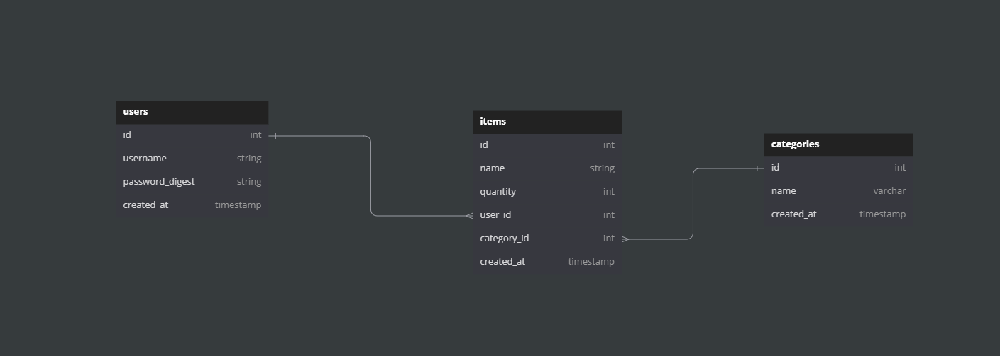

# Phase 4 Project 

## Overview

This repository uses ruby on rails as the backend & communicate to the database, and React as the frontend to create a To-do list app. 

## Features

This app has the following functions:

- A user can create an account and login/logout of the app as needed

- A user can create to-do lists and add items to said list

- A user has three main views - login, items, categories

The item model has full CRUD capabilities, while most of the other models mainly have read and create functions. Below are demos of the item and category pages respectively

[Item](./images/item_demo.gif)

[Category](./images/category_demo.gif)

Below is a diagram showcasing the relationship between the tables:

## Installation Instructions

- Make sure to have ruby installed on your PC (With Linux use `sudo apt install ruby-full`)

## License

[MIT](https://choosealicense.com/licenses/mit/)